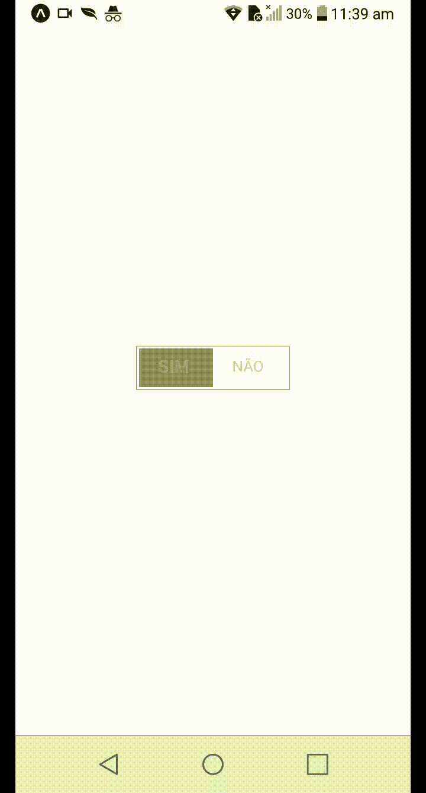

# REACT NATIVE REANIMATED

Recriando o botão switch para implementação em formulário. Desenvolvido com uso da lib react-native-reanimated.

## IMPLEMENTAÇÃO

Copie a pasta switchButton dentro de component para dentro do seu projeto. Uma vez copiado, chame-o dentro do arquivo view que deseja exibi-lo com import.

```sh
import SwitchButton from './component/switchButton'
```

## Demo



## Props

| PROPRIEDADE | DESCRICÇÃO |
| ------ | ------ |
| IsOn | Informa o estado atual da chave. Ex. True or False |
| Width | Seta dimensão em largura do botão|
| Height | Seta dimensão em altura do botão |
| NameOn | Seta um nome para chave ON |
| NameOff | Seta um nome para chaave OFF |
| style | Seta um novo estilo para o elemento animado da chave |
| textStyle | Seta um novo estilo para o elemento texto do botão |
| buttonSwitchStyle |  Seta um novo estilo para o containner do botão |
